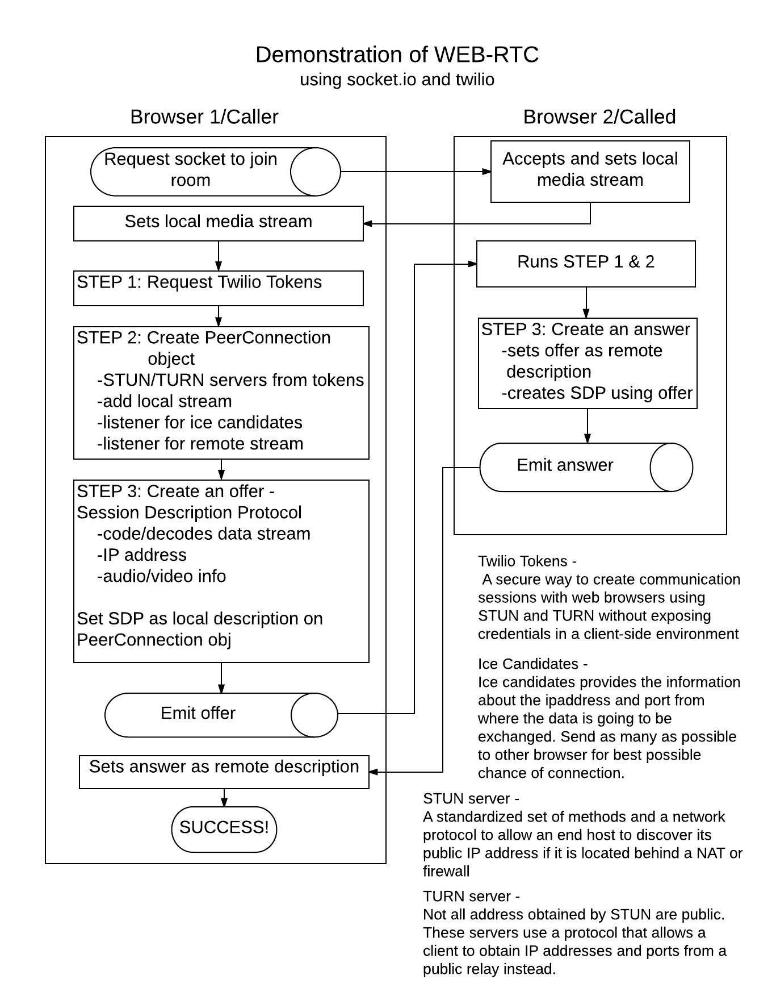

# Welcome to Sky-Pie!

Sky-Pie is a Node/Express app utilizing WEB-RTC and Socket.io for real-time video conferencing and text chat. The flow chart below shows the step by step connection of two browsers and the tools that help that connection happen. Feel free to check out the hosted version [here](https://sky-pie.herokuapp.com) to chat with someone!

